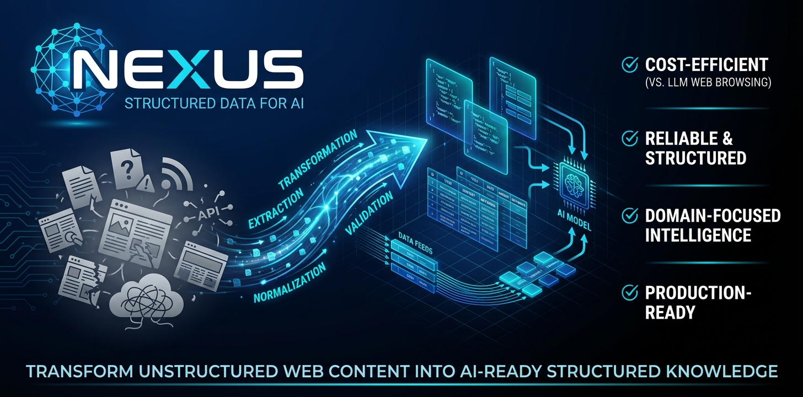

<div align="center">
  

<h1>Nexus: $100/month LLM browsing → $1/month Nexus API</h1>
  <p><strong>The Missing Infrastructure Layer for AI Applications</strong></p>

  [](https://opensource.org/licenses/MIT)
  [](https://www.python.org/downloads/)
  [](https://fastapi.tiangolo.com/)
  [](https://nextjs.org/)

<p>Transform unstructured web content into AI-ready structured knowledge</p>
  <p><strong>10-100x cheaper</strong> than real-time LLM browsing | <strong>Production-ready</strong> | <strong>Domain-focused</strong></p>
</div>

---

## 💡 Why Nexus?

Everyone believes AI agents can "just browse the web" — but in production, this approach fails:

| Problem                   | Reality                                                                           | Nexus Solution                        |
| ------------------------- | --------------------------------------------------------------------------------- | ------------------------------------- |
| 🔥**Cost**          | LLM browsing costs $0.10-1.00 per query | Pre-process once, serve 1000x at $0.001 |                                       |
| 🎯**Reliability**   | LLMs hallucinate on complex HTML                                                  | Structured extraction with validation |
| ⚡**Speed**         | 10-30s per page load                                                              | Instant API response (<100ms)         |
| 🔄**Freshness**     | Manual refresh needed                                                             | Automated scheduled updates           |
| 🌐**Chinese Sites** | Poor LLM performance                                                              | Optimized parsers for CN web          |

**The truth**: Production AI applications need a **data infrastructure layer** between raw web and LLM reasoning. That's Nexus.


## ✨ What Makes Nexus Different

### 🎯 Built for Production, Not Demos

Most web scrapers are toys. Nexus is battle-tested infrastructure:

- **181 data sources** running in production (138 active)
- **2,200+ articles** processed daily across 9 domains
- **2,600+ scholar profiles** from top universities
- **65+ REST API endpoints** serving 4 production applications

### 🧠 Smart Extraction, Not Brute Force

**6 specialized crawler types** for different scenarios:

| Type                 | Use Case               | Example                              |
| -------------------- | ---------------------- | ------------------------------------ |
| 🌐**Static**   | Standard HTML pages    | Government portals, news sites       |
| ⚡**Dynamic**  | JavaScript-heavy sites | Modern web apps (Playwright)         |
| 📡**RSS**      | Feed-based content     | Blogs, podcasts                      |
| 📸**Snapshot** | Change detection       | Policy documents, regulations        |
| 🔌**API**      | Direct integrations    | GitHub, arXiv, Twitter               |
| 🤖**LLM**      | Zero-config extraction | Any website (AI-powered, $0.01/page) |

### 🎨 Domain Intelligence, Not Generic Data

Pre-built pipelines for vertical domains:

- **Policy Intelligence**: Funding opportunities, regulatory changes
- **Tech Frontier**: Research trends, breakthrough signals
- **Scholar Graph**: Academic networks, collaboration patterns
- **Personnel Tracking**: Leadership changes, appointments

### 🎛️ Control Panel, Not CLI Hell

Web UI for non-technical users:

- Visual source management
- Real-time monitoring
- One-click exports (JSON/CSV/DB)
- Domain filtering controls

## 🏗️ Architecture

<details>
<summary><strong>Click to view system architecture</strong></summary>

```
┌─────────────────────────────────────────────────────────────┐
│                     YAML Configurations                      │
│  sources/*.yaml (181 sources × 9 dimensions)                │
└────────────────────┬────────────────────────────────────────┘
                     │
                     ▼
┌─────────────────────────────────────────────────────────────┐
│                   Crawler Registry                           │
│  Routes to appropriate crawler based on config               │
└──┬──────────┬──────────┬──────────┬──────────┬─────────────┘
   │          │          │          │          │
   ▼          ▼          ▼          ▼          ▼
┌──────┐  ┌────────┐  ┌─────┐  ┌─────────┐  ┌─────┐
│Static│  │Dynamic │  │ RSS │  │Snapshot │  │ API │
│httpx │  │Playwrt │  │Feed │  │ Hash    │  │ GH  │
│ BS4  │  │  BS4   │  │Parse│  │ Diff    │  │arXiv│
└──┬───┘  └───┬────┘  └──┬──┘  └────┬────┘  └──┬──┘
   │          │          │          │          │
   └──────────┴──────────┴──────────┴──────────┘
                     │
                     ▼
┌─────────────────────────────────────────────────────────────┐
│              Supabase PostgreSQL Database                    │
│  • 2,200+ articles  • 2,600+ scholars  • Deduplication      │
└────────────────────┬────────────────────────────────────────┘
                     │
                     ▼
┌─────────────────────────────────────────────────────────────┐
│              Business Intelligence Pipeline                  │
│  Policy → Personnel → Tech Frontier → Daily Briefing        │
└────────────────────┬────────────────────────────────────────┘
                     │
         ┌───────────┴───────────┐
         ▼                       ▼
┌──────────────────┐    ┌──────────────────┐
│   FastAPI (65+)  │    │  Next.js Frontend│
│   REST Endpoints │    │  Control Panel   │
└──────────────────┘    └──────────────────┘
```

**Key Components**:

- **Crawler Templates**: Reusable extraction patterns
- **Source Registry**: Dynamic routing based on YAML config
- **Deduplication**: SHA-256 URL hashing + content fingerprinting
- **Scheduler**: APScheduler for automated updates
- **Intelligence Layer**: Domain-specific processing pipelines

## ⚡ Quick Start (5 minutes)

### One-Command Deploy

```bash
git clone https://github.com/yourusername/nexus.git
cd nexus
./deploy.sh  # Handles everything: venv, dependencies, Playwright, services
```

That's it! Backend runs at `http://localhost:43817`, frontend at `http://localhost:43819`.

### Try It Out

```bash
# Add a data source (edit sources/technology.yaml)
# Run a test crawl
python scripts/crawl/run_single.py --source arxiv_cs_ai

# Query the API
curl "http://localhost:43817/api/v1/articles?dimension=technology&limit=5"
```


## 📖 Usage Examples

### Add a New Data Source

Edit `sources/{dimension}.yaml`:

```yaml
- id: "my_source"
  name: "My Data Source"
  url: "https://example.com/news"
  crawl_method: "static"  # or dynamic, rss, snapshot

  # Content filtering (3 options - see sources/README.md for details):
  # Option 1: Domain-based (recommended)
  domain_filter: "technology.ai"

  # Option 2: Custom keywords
  # keyword_filter: ["AI", "machine learning"]
  # keyword_blacklist: ["advertisement"]

  # Option 3: No filter (keep all)

  selectors:
    list: ".article-list .item"
    title: ".title"
    link: "a"
    date: ".date"
  schedule: "daily"
  is_enabled: true
  tags:
    - technology
    - ai
```

**Filtering Guide**: See [sources/README.md](sources/README.md) for complete filtering options.

### Test Single Source

```bash
python scripts/crawl/run_single.py --source my_source
```

### Apply Domain Filtering

```bash
# Filter by AI domain
python scripts/crawl/run_single.py --source my_source --domain technology.ai

# Multiple domains
python scripts/crawl/run_single.py --source my_source --domain technology.ai,economy.finance

# Use domain group
python scripts/crawl/run_single.py --source my_source --domain-group tech_all
```

### Access API

```bash
# Get articles
curl "http://localhost:43817/api/v1/articles?dimension=technology&limit=10"

# Get source status
curl "http://localhost:43817/api/v1/sources/stats"

# Get scholars
curl "http://localhost:43817/api/v1/scholars?institution=清华大学"
```

## 🎯 Real-World Use Cases

### 🤖 AI Application Developers

**Problem**: Your AI agent needs to "know" what's happening in your industry, but LLM browsing is expensive and unreliable.

**Solution**: Point your agent to Nexus APIs. Get structured, validated data at 1/100th the cost.

```python
# Instead of this (expensive, slow, unreliable):
response = llm.browse("https://arxiv.org/list/cs.AI/recent")

# Do this (fast, cheap, reliable):
articles = requests.get("http://nexus/api/v1/articles?dimension=technology&source=arxiv_cs_ai")
```

**ROI**: $100/month LLM browsing → $1/month Nexus API

### 🏛️ Research Institutions

**Problem**: Manually tracking policy changes, funding opportunities, and academic movements across dozens of sources.

**Solution**: Automated daily briefings with intelligent filtering.

**Real deployment**: Battle-tested in production at a leading Chinese AI research institution, serving leadership teams with policy intelligence and scholar tracking.

### 🏢 Enterprise Intelligence Teams

**Problem**: Competitive intelligence requires monitoring hundreds of sources daily.

**Solution**: Domain-specific pipelines with keyword filtering and trend detection.

**Example**: Track AI startup funding, tech breakthroughs, and talent movements in one dashboard.

## 📚 Documentation

- **[Architecture Guide](docs/architecture.md)** - System design & decisions
- **[API Reference](http://localhost:43817/docs)** - Interactive Swagger docs
- **[Source Catalog](docs/SourceOverview.md)** - All 181 data sources
- **[Development Roadmap](docs/TODO.md)** - Upcoming features

## 🤝 Contributing

We welcome contributions! Whether you're adding new data sources, improving crawler templates, or building domain-specific pipelines.

**Quick start**: Check [CONTRIBUTING.md](CONTRIBUTING.md) for guidelines.

## 📧 Get in Touch

- **GitHub Issues**: [Report bugs or request features](https://github.com/yourusername/nexus/issues)
- **Email**: mhumble010221@gmail.com

<div align="center">
  <strong>Stop paying $100/month for LLM browsing.</strong><br>
  <strong>Start building on reliable data infrastructure.</strong>

<p>⭐ Star us on GitHub if Nexus helps your project!</p>
</div>
