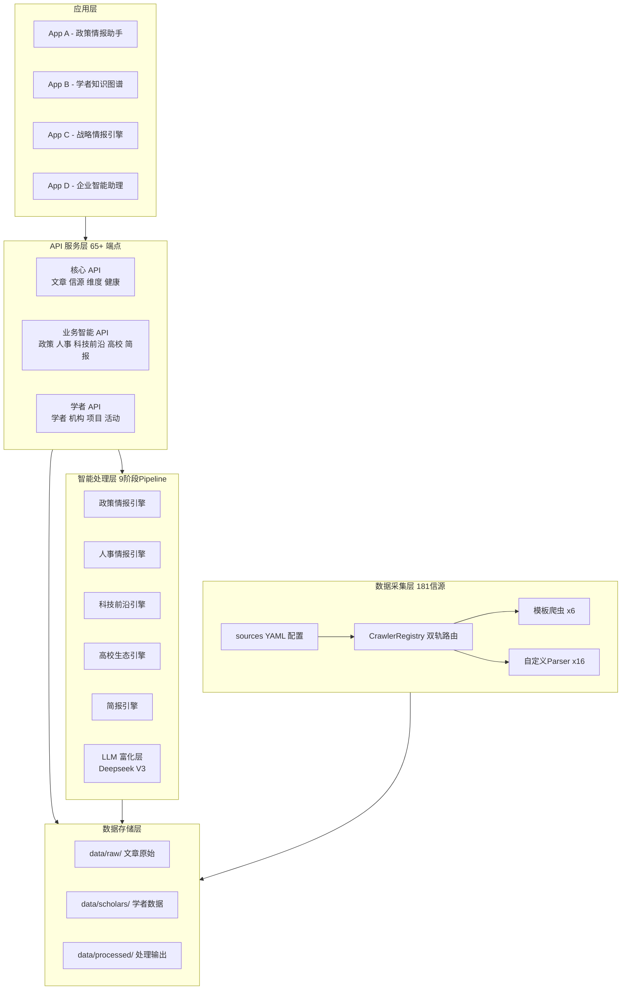
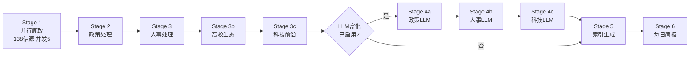

# Nexus — 架构设计文档

> 最后更新: 2026-03-06 | 版本: v2.0

Nexus 是一个生产级数据情报平台，为下游 AI 应用提供统一的数据采集、处理与 API 服务。

---

## 一、平台概览

### 5 层架构总图

```
╔══════════════════════════════════════════════════════════════════╗
║  📱 应用层                                                        ║
║  App A (政策情报助手)    │ App B (学者知识图谱)                    ║
║  App C (战略情报引擎)   │ App D (企业智能助理)                  ║
╠══════════════════════════════════════════════════════════════════╣
║  🔌 API 服务层  /api/v1 — 65+ REST 端点                           ║
║  文章/信源/维度/健康  │  政策/人事/科技/高校/简报(intel)            ║
║  学者/机构/项目/活动  │  AMiner/舆情/LLM追踪                       ║
╠══════════════════════════════════════════════════════════════════╣
║  🧠 智能处理层 — 9 阶段 Pipeline                                   ║
║  政策情报引擎  │  人事情报引擎  │  科技前沿引擎                     ║
║  高校生态引擎  │  每日简报引擎  │  LLM 富化层 (Deepseek V3)        ║
╠══════════════════════════════════════════════════════════════════╣
║  💾 数据存储层 — 纯 JSON 分层                                       ║
║  data/raw/ (文章原始)  │  data/scholars/ (学者/机构/项目)           ║
║  data/processed/ (处理输出)  │  data/state/ + data/logs/           ║
╠══════════════════════════════════════════════════════════════════╣
║  🕷️ 数据采集层 — 181 信源 × 9 维度                                 ║
║  APScheduler 自动调度  │  CrawlerRegistry 双轨路由                  ║
║  模板爬虫 ×6           │  自定义 Parser ×16                        ║
╚══════════════════════════════════════════════════════════════════╝
```

### Mermaid 架构图



### 核心数据流

```
sources/*.yaml
     ↓ 配置读取
APScheduler（2h/4h/daily/weekly/monthly 触发）
     ↓
CrawlerRegistry（crawler_class 优先 → crawl_method 兜底）
     ↓
爬虫实例执行 fetch_and_parse()
     ↓
BaseCrawler.run()：SHA-256 去重 + 计时 + 异常封装
     ↓
data/raw/{dimension}/{group}/{source_id}/latest.json
     ↓
9 阶段 Pipeline（规则 → LLM 富化 → 索引 → 简报）
     ↓
data/processed/（5 个处理模块）
     ↓
REST API /api/v1  ←  4 个消费端
```

---

## 二、数据采集层

### 2.1 YAML 配置驱动设计

所有信源以 YAML 声明，新增标准信源零代码，配置文件位于 `sources/*.yaml`（每维度一个文件）：

```yaml
- id: "gov_cn_zhengce"
  name: "中国政府网-最新政策"
  group: "policy"
  url: "https://www.gov.cn/zhengce/"
  crawl_method: "static"             # static/dynamic/rss/snapshot
  schedule: "2h"                     # 2h/4h/daily/weekly/monthly
  priority: 1
  is_enabled: true
  selectors:
    list_item: "ul.list li"
    title: "a"
    link: "a"
    date: "span.date"
    date_format: "%Y-%m-%d"
  base_url: "https://www.gov.cn"
  detail_selectors:                  # 可选：正文抓取
    content: "div.article-content"
  keyword_filter: ["人工智能"]
```

**优先级**：`crawler_class`（自定义 Parser）> `crawl_method`（模板）

### 2.2 CrawlerRegistry 双轨路由

文件：`app/crawlers/registry.py`

```python
_CUSTOM_MAP = {
    "gov_json_api":    "parsers.gov_json_api:GovJSONAPICrawler",
    "arxiv_api":       "parsers.arxiv_api:ArxivAPICrawler",
    "github_api":      "parsers.github_api:GitHubAPICrawler",
    "hacker_news_api": "parsers.hacker_news_api:HackerNewsAPICrawler",
    "semantic_scholar":"parsers.semantic_scholar:SemanticScholarCrawler",
    "twitter_kol":     "parsers.twitter_kol:TwitterKOLCrawler",
    "twitter_search":  "parsers.twitter_search:TwitterSearchCrawler",
    "hunyuan_api":     "parsers.hunyuan_api:HunyuanAPICrawler",
    "llm_faculty":     "parsers.llm_faculty:LLMFacultyCrawler",
    "sjtu_cs_scholar": "parsers.sjtu_cs_faculty:SJTUCSFacultyCrawler",
    "sjtu_ai_scholar": "parsers.sjtu_ai_faculty:SJTUAIFacultyCrawler",
    "iscas_scholar":   "parsers.iscas_faculty:ISCASFacultyCrawler",
    "zju_cyber_scholar":"parsers.zju_cyber_faculty:ZJUCyberFacultyCrawler",
    "ymsc_scholar":    "parsers.ymsc_faculty:YMSCFacultyCrawler",
    ...
}
_METHOD_MAP = {
    "static":   "templates.static_crawler:StaticHTMLCrawler",
    "dynamic":  "templates.dynamic_crawler:DynamicPageCrawler",
    "rss":      "templates.rss_crawler:RSSCrawler",
    "snapshot": "templates.snapshot_crawler:SnapshotDiffCrawler",
    "faculty":  "templates.scholar_crawler:ScholarCrawler",  # LLM 学者爬虫通用模板
}
```

Registry 使用 `importlib` 懒加载，避免启动时全量导入。

### 2.3 BaseCrawler 合约

文件：`app/crawlers/base.py`

```python
class BaseCrawler(ABC):
    async def run() -> CrawlResult          # 主入口（基类实现）
    async def fetch_and_parse() -> list[CrawledItem]  # 子类必须实现
```

`run()` 统一处理：计时、异常捕获、SHA-256 去重、状态枚举（`SUCCESS / NO_NEW_CONTENT / PARTIAL / FAILED`）、返回 `CrawlResult`。

**三层继承关系：**

```
BaseCrawler
├── 模板爬虫（templates/）—— 覆盖 ~80% 信源
│   ├── StaticHTMLCrawler       httpx + BeautifulSoup
│   ├── DynamicPageCrawler      Playwright 浏览器池
│   ├── RSSCrawler              feedparser
│   ├── SnapshotDiffCrawler     hash diff 变化检测
│   ├── SocialMediaCrawler      社交媒体抽象基类
│   └── ScholarCrawler          LLM 学者爬虫基类
└── 自定义 Parser（parsers/）—— API/特殊格式
    ├── ArxivAPICrawler / GitHubAPICrawler / HackerNewsAPICrawler
    ├── TwitterKOLCrawler / TwitterSearchCrawler
    ├── SemanticScholarCrawler / HunyuanAPICrawler / GovJSONAPICrawler
    └── LLMFacultyCrawler（通用 LLM 自适应）
        ├── SJTUCSFacultyCrawler / SJTUAIFacultyCrawler
        ├── ISCASFacultyCrawler / ZJUCyberFacultyCrawler
        └── YMSCFacultyCrawler
```

### 2.4 爬虫类型对比

| 模板 | 适用场景 | 核心依赖 | 信源数 |
|------|---------|---------|-------|
| static | 服务端渲染 HTML 列表页 | httpx + BeautifulSoup | ~85 |
| dynamic | JS 渲染页面 | Playwright 浏览器池 | ~22 |
| rss | RSS/Atom 订阅源 | feedparser | ~10 |
| snapshot | 内容变化检测 | hash diff | <5 |
| 自定义 Parser | API/特殊格式 | 各 API | ~17 |
| LLM Faculty | 任意结构学者页面 | LLM + httpx | ~47 |

### 2.5 APScheduler 调度策略

```python
SCHEDULE_MAP = {
    "2h":     IntervalTrigger(hours=2),
    "4h":     IntervalTrigger(hours=4),
    "daily":  CronTrigger(hour=6, minute=0),
    "weekly": CronTrigger(day_of_week="mon", hour=3),
    "monthly":CronTrigger(day=1, hour=2),
}
```

**重要约束**：APScheduler 3.x 单 Worker（`--workers 1`），不支持多进程协调。

---

## 三、数据存储层

### 3.1 目录结构

```
data/
├── raw/{dimension}/{group}/{source_id}/latest.json     # 文章原始数据
├── scholars/{university_group}/{source_id}/latest.json # 学者采集原始
├── scholars/institutions.json                          # 机构图谱（自动重建）
├── scholars/projects.json                              # 项目库
├── scholars/events.json                                # 学术活动
├── processed/
│   ├── policy_intel/feed.json + opportunities.json
│   ├── personnel_intel/feed.json + changes.json + enriched_feed.json
│   ├── tech_frontier/topics.json + opportunities.json + stats.json
│   ├── university_eco/overview.json + feed.json + research_outputs.json
│   └── daily_briefing/briefing.json
├── state/
│   ├── source_state.json        # 每源：last_crawl_at, failures, is_enabled_override
│   ├── article_annotations.json # 文章用户标注（is_read, importance）
│   ├── scholar_annotations.json # 学者用户标注
│   └── snapshots/{source_id}.json
└── logs/{source_id}/crawl_logs.json  # 每源最多 100 条
```

### 3.2 文章 Item Schema

```json
{
  "title": "...",
  "url": "https://...",
  "url_hash": "sha256_64chars",
  "published_at": "2026-03-06T00:00:00",
  "author": null,
  "content": "正文纯文本",
  "source_id": "pku_news",
  "dimension": "universities",
  "tags": ["university", "pku"],
  "extra": {},
  "is_new": true
}
```

### 3.3 增量去重机制

**采集层**：`dedup.py` 对 URL 归一化后 SHA-256，与前次 `latest.json` 的 url_hashes 对比，新增标记 `is_new: true`。

**处理层**：`HashTracker`（`pipeline/base.py`）记录已处理的 article url_hash，LLM 富化不重复调用。支持 `--force` 强制重跑。

---

## 四、智能处理层

### 4.1 9 阶段 Pipeline



| 阶段 | 数据源 | 处理方式 | 估算耗时 |
|------|--------|---------|---------|
| 并行爬取 | 138 信源 | 并发 5，含进度条 | 5-10 分钟 |
| 政策处理 | national_policy + beijing_policy | 规则引擎评分 | ~30 秒 |
| 人事处理 | personnel | 正则提取任免变动 | ~10 秒 |
| 高校生态 | universities | 关键词分类 | ~20 秒 |
| 科技前沿 | technology + twitter | 8 主题匹配 + 热度 | ~40 秒 |
| LLM 富化 | 以上三类 | Deepseek V3 深度分析 | ~2-5 分钟 |
| 索引生成 | 全量 | data/index.json | ~5 秒 |
| 每日简报 | 全维度 | LLM 叙事生成 | ~30 秒 |

**LLM 富化触发条件**：`ENABLE_LLM_ENRICHMENT=true` + `OPENROUTER_API_KEY` 同时配置。

### 4.2 5 个情报处理模块

| 模块 | 服务路径 | 处理器 | 输出目录 |
|------|---------|-------|---------|
| 政策情报 | `services/intel/policy/` | `policy_processor.py` | `processed/policy_intel/` |
| 人事情报 | `services/intel/personnel/` | `personnel_processor.py` | `processed/personnel_intel/` |
| 科技前沿 | `services/intel/tech_frontier/` | `tech_frontier_processor.py` | `processed/tech_frontier/` |
| 高校生态 | `services/intel/university/` | `university_eco_processor.py` | `processed/university_eco/` |
| 每日简报 | `services/intel/daily_briefing/` | `briefing_processor.py` | `processed/daily_briefing/` |

每个模块包含：`rules.py`（规则引擎）、`llm.py`（LLM 调用）、`service.py`（API 查询逻辑）。

### 4.3 LLM 服务架构

```
app/services/llm/
├── llm_service.py       # Provider 路由（OpenRouter/Siliconflow/DashScope）
└── llm_call_tracker.py  # 调用追踪（次数/tokens/成本/审计日志）
```

推荐模型：`deepseek/deepseek-chat`（$0.27/M 输入，$1.10/M 输出）。通过 `.env` 切换 Provider，业务代码无感知。

---

## 五、API 服务层

### 5.1 端点模块汇总（65+ 端点）

| Router | 路径前缀 | 端点数 | 主要功能 |
|--------|---------|-------|---------|
| articles | `/articles` | 5 | 列表/搜索/统计/详情/标注 |
| sources | `/sources` | 5 | 信源管理/日志/手动触发 |
| dimensions | `/dimensions` | 2 | 9 维度概览/维度文章列表 |
| health | `/health` | 4 | 系统状态/爬取健康/Pipeline/触发 |
| scholars | `/scholars` | 14+ | 学者 CRUD/成就/导学关系 |
| institutions | `/institutions` | 5 | 机构树 CRUD |
| scholar_institutions | `/institutions/scholars` | 2 | 机构-学者统计 |
| events | `/events` | 8 | 活动 CRUD + 学者关联 |
| projects | `/projects` | 6 | 项目库 CRUD |
| aminer | `/aminer` | 3 | AMiner 机构/学者检索 |
| sentiment | `/sentiment` | 3 | 社交舆情 Feed/详情 |
| llm_tracking | `/llm-tracking` | 6 | LLM 用量/成本审计 |
| intel/policy | `/intel/policy` | 3 | 政策 Feed/机会/统计 |
| intel/personnel | `/intel/personnel` | 5 | 人事 Feed/变动/LLM 富化 |
| intel/tech-frontier | `/intel/tech-frontier` | 5 | 科技主题/机会/统计/信号 |
| intel/university | `/intel/university` | 4 | 高校 Feed/概览/研究成果 |
| intel/daily-briefing | `/intel/daily-briefing` | 3 | 今日/最新/历史简报 |

基础路径：`/api/v1`。Swagger UI：`http://localhost:8001/docs`

### 5.2 通用过滤参数

所有文章类 API 支持信源过滤（`app/services/intel/shared.py`）：

| 参数 | 类型 | 匹配方式 |
|------|------|---------|
| `source_id` | 单个 ID | 精确匹配 |
| `source_ids` | 逗号分隔 ID | 精确匹配 |
| `source_name` | 单个名称 | 模糊（子串/大小写/空格不敏感） |
| `source_names` | 逗号分隔名称 | 模糊匹配 |

---

## 六、消费端接入

### 6.1 接入现状

| 消费端 | 服务对象 | 主要接入 API |
|--------|---------|------------|
| **政策情报助手** | 管理层、决策者 | `/intel/policy` `/intel/personnel` `/intel/daily-briefing` |
| **学者知识图谱** | 科研管理 | `/scholars` `/institutions` `/projects` `/events` |
| **战略情报引擎** | 战略分析部门 | `/articles` `/intel/*` `/sentiment` |
| **企业智能助理** | 全员（MCP 协议） | 全量 API（MCP 协议封装） |

### 6.2 典型调用路径

```
政策情报助手 — 每日情报
  GET /intel/daily-briefing/today      → 当日综合简报
  GET /intel/policy/feed               → 政策动态（规则+LLM评分）
  GET /intel/personnel/enriched-feed   → 人事变动（LLM 富化）
  GET /intel/tech-frontier/topics      → 8 大科技主题热度

学者知识图谱 — 学者管理
  GET /scholars/?keyword=计算机视觉
  GET /scholars/{url_hash}             → 学者详情（含 AMiner 补全）
  POST /scholars/{url_hash}/students   → 添加导学关系
  GET /projects/?status=在研           → 在研项目列表

企业智能助理 — 自然语言查询（MCP 封装）
  用户：「最近 AI 政策有哪些变化？」
    → MCP 调用 GET /intel/policy/feed?keyword=人工智能
  用户：「帮我找某院校计算机系的学者」
    → MCP 调用 GET /scholars/?department=计算机系
```

---

## 七、关键设计决策

1. **APScheduler 3.x，不用 4.x** — 4.x 是 alpha，pip 安装不到稳定版；单 Worker 是唯一安全配置

2. **URL 归一化保留 fragment** — snapshot_crawler 用 `#snapshot-{hash}` 区分同 URL 不同快照

3. **纯 JSON 存储，无数据库** — 轻量可维护，零运维 DB；并发安全靠 APScheduler 单 Worker 保证

4. **信源配置 YAML / 运行状态 JSON 分离** — YAML git 版本化，`source_state.json` 存动态状态

5. **crawler_class 优先于 crawl_method** — 自定义 Parser 处理 API/特殊格式，模板爬虫处理标准页面

6. **CrawlLog 记录爬虫创建失败** — 即使实例化出错也可通过 `/sources/{id}/logs` 追溯

7. **JSON 级去重** — 对比 previous latest.json 的 url_hashes 标记 is_new，无需数据库查询

8. **static/dynamic 共享解析逻辑** — `selector_parser.py` 提取公共函数，消除 ~100 行重复

9. **业务智能模块子包结构** — `services/intel/{domain}/` 每维度独立子包，共享工具在 `shared.py`

10. **HashTracker 增量处理** — 记录已处理 url_hash，LLM 不重复调用；支持 `--force` 强制重跑

11. **文章/学者 ID 用 url_hash** — SHA-256 64 字符，全局唯一，替代 DB 自增 ID

12. **首次启动自动触发 Pipeline** — `_check_needs_initial_data()` 检测空数据后异步触发

13. **LLM 多 Provider 路由** — `llm_service.py` 统一封装，改 `.env` 切换 Provider，业务代码无感知

14. **学者采集独立存储路径** — `data/scholars/` 与 `data/raw/` 分离，Scholar API 与 Article API 数据源隔离

